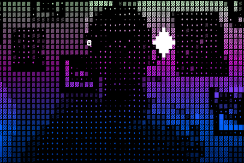

# Processing Ascii Video player



Uses processing.org to create a nice ascii cam with some glyphs that fly around.

The glyphs are powered by midi messages from Supercollider using the following code:

```
f = { |msg, time, addr|
    if(msg[0] == '/rms') {
		var o = msg[2];
		var vol = (msg[4] + msg[6]);
		if (o < 8) {
			~virtualMidiMapping.control(0,o+1,(vol*255).min(127));
		}
    }
};
thisProcess.addOSCRecvFunc(f);
```

So you can do visualizations from Tidal Cycles using that data.
